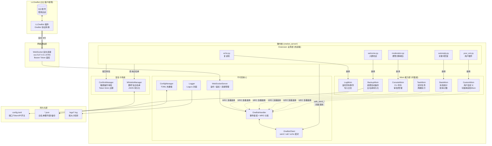
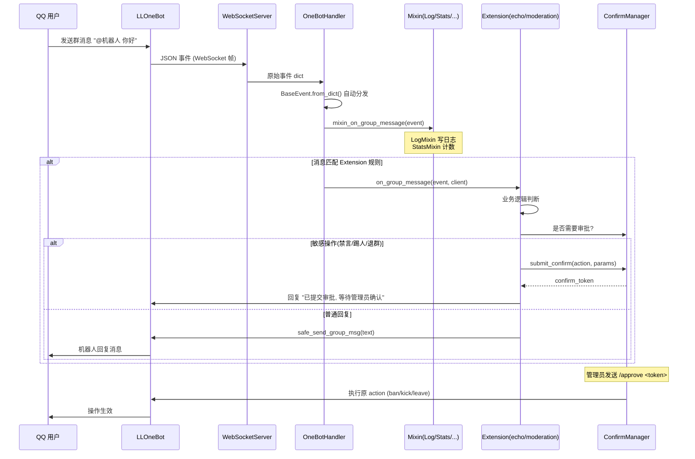
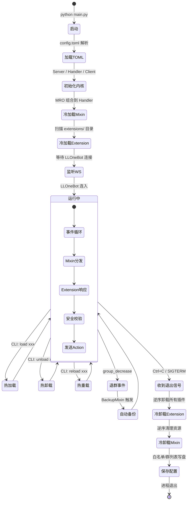

# OneBot 11 Server 架构图

## 总览架构



## 权限边界图

```mermaid
flowchart LR
    subgraph L1["🔴 内核层 (不可修改)"]
        A1["WebSocketServer"]
        A2["OneBotHandler"]
        A3["OneBotClient"]
        A4["ConfirmManager"]
        A5["WhitelistManager"]
    end

    subgraph L2["🟡 Mixin 层 (可插拔/可继承)"]
        B1["LogMixin"]
        B2["BackupMixin"]
        B3["ConsoleMixin"]
        B4["TaskMixin"]
        B5["StatsMixin"]
        B6["CustomMixin"]
    end

    subgraph L3["🟢 Extension 层 (热加载/热卸载)"]
        C1["echo.py"]
        C2["autoreply.py"]
        C3["moderation.py"]
        C4["welcome.py"]
        C5["your_ext.py"]
    end

    L3 -->|"继承(extends)"| L2
    L3 -.->|"❌ 禁止直接访问"| L1
    L2 -->|"MRO 注入"| L1
```



## 事件流时序图



## 生命周期图



## 目录结构图

```mermaid
flowchart TB
    Root["onebot11_server/"]
    Root --> Main["main.py<br/>━━━━━━━━━━<br/>入口: 读 TOML → 创建 Server → run_forever()"]
    Root --> Cfg["config.toml<br/>━━━━━━━━━━<br/>port / host / token<br/>admins / whitelist<br/>mixin / extension 开关"]
    Root --> Req["requirements.txt<br/>━━━━━━━━━━<br/>websockets<br/>loguru"]
    Root --> Doc["DOCUMENTATION.md<br/>━━━━━━━━━━<br/>1700+ 行完整文档"]

    Root --> Pkg["onebot_server/<br/>━━━━━━━━━━<br/>核心包"]
    Pkg --> Init["__init__.py<br/>统一导出"]
    Pkg --> Config["config.py<br/>TOML 管理 + 热重载"]
    Pkg --> Logger["logger.py<br/>Loguru 封装"]
    Pkg --> Events["events.py<br/>12 种事件模型"]
    Pkg --> Actions["actions.py<br/>20+ Action + 消息段"]
    Pkg --> Client["client.py<br/>WS 客户端封装"]
    Pkg --> Confirm["confirm.py<br/>审批管理器"]
    Pkg --> Whitelist["whitelist.py<br/>白名单管理"]
    Pkg --> ExtBase["extension_base.py<br/>Extension 基类"]
    Pkg --> ExtMgr["extension_manager.py<br/>4 种加载模式"]
    Pkg --> Handler["handler.py<br/>事件枢纽 + Mixin 代理"]
    Pkg --> Server["server.py<br/>WS 服务器 + CLI"]

    Pkg --> Mixin["mixin/<br/>━━━━━━━━━━<br/>内置 Mixin"]
    Mixin --> LogMix["log_mixin.py")
    Mixin --> BackupMix["backup_mixin.py")
    Mixin --> ConsoleMix["console_mixin.py")
    Mixin --> TaskMix["task_mixin.py")
    Mixin --> StatsMix["stats_mixin.py<br/>(继承 StatsMixin)")

    Root --> Exts["extensions/<br/>━━━━━━━━━━<br/>用户插件"]
    Exts --> Echo["echo.py")
    Exts --> AutoReply["autoreply.py")
    Exts --> Moderation["moderation.py")
    Exts --> Welcome["welcome.py")

    Root --> Tests["tests/<br/>━━━━━━━━━━<br/>55 项测试"]
```
